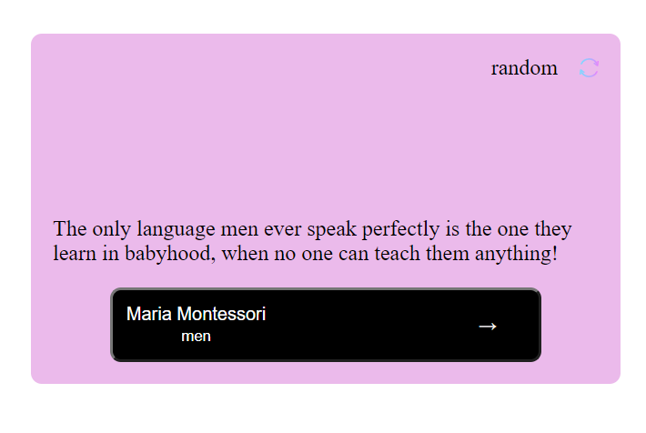

# Random Quote Generator in React

<h1 align="center">Random Quote Generator</h1>

<div align="center">
  <h3>
    <a href="https://lightme-fan-random-quote-generator.netlify.app/">
      Demo
    </a>
    <span> | </span>
    <a href="https://github.com/lightme-fan/react-random-quote-generator">
      Solution
    </a>
  </h3>
</div>

[Check the design link here](https://www.figma.com/file/FFxqnf1cEDiHhvFpN6u4hV)

<!-- TABLE OF CONTENTS -->


<!-- OVERVIEW -->

## Overview



-   You see my demo by clicking this [demo](https://lightme-fan-random-quote-generator.netlify.app/)
-   What I learnt from this project to change any content or text into link. 

### Built With

This porject is built with [React](https://reactjs.org/).

## How To Use

<!-- Example: -->

To clone and run this application, you'll need [Git](https://git-scm.com) and [Node.js](https://nodejs.org/en/download/) (which comes with [npm](http://npmjs.com)) installed on your computer. 

```bash
# Clone this repository
$ git clone https://github.com/lightme-fan/react-random-quote-generator

# Install dependencies
$ npm react react-dom react-dom-rooter

# Run the app
$ parcel index.html
```

## Contact

-   Website [your-website.com](https://lightme-fan-portfolio.netlify.app/)
-   GitHub [@your-username](https://github.com/lightme-fan)
